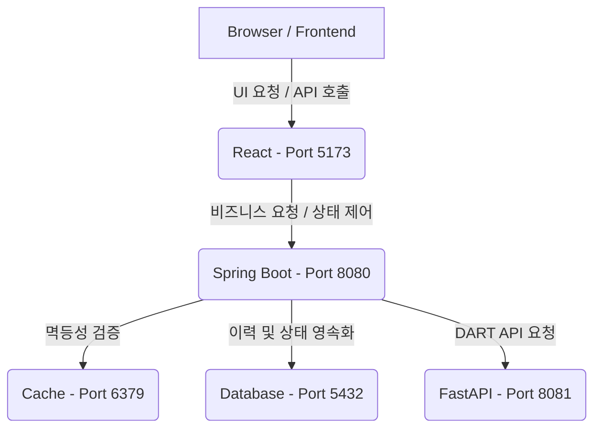

# Financial - Docker Compose 통합 실행 환경 (finance-infra)

본 저장소는 프로젝트 전체 서비스(Frontend, Backend, Mock Server, PostgreSQL, Redis)를 Docker Compose를 사용하여 단일 명령어로 손쉽게 기동하고 관리할 수 있도록 설계된 인프라 및 설정 전용 저장소입니다.

---

## 1. 시스템 아키텍처

전체 시스템의 구조와 서비스 연동 관계는 다음과 같습니다.



| 서비스명 | 기술 스택 | 역할 | 외부 포트 |
| :--- | :--- | :--- | :--- |
| **Frontend** | React (Vite) | 사용자 요청 전송, 실행 상태 관제 및 수동 재처리 UI | `5173` |
| **Main Backend** | Spring Boot | 핵심 비즈니스 로직, 상태 변이(State Machine), Retry 제어, 인증 처리 | `8080` |
| **Mock Server** | FastAPI | DART API 정상/장애(Rate Limit, Timeout 등) 시뮬레이션 응답 제공 | `8081` |
| **Database** | PostgreSQL | 인터페이스 실행 이력 및 상태 영속화 | `5432` |
| **Cache** | Redis | `Idempotency-Key` 캐싱을 통한 중복 요청 및 동시성 방어 | `6379` |

---

## 2. 사전 준비 사항

서비스를 정상적으로 빌드 및 실행하기 위해 아래 도구들이 설치되어 있어야 합니다.

- **Docker Desktop** (버전 `20.10.0` 이상 권장)
- **Docker Compose** (버전 `2.0.0` 이상 권장)

---

## 3. 빠른 시작 가이드 (Quick Start)

### 단계 1: 환경 변수 설정
Docker Compose 실행 시 API 인증 및 외부 연동을 위해 환경 변수가 설정되어 있어야 합니다.

`infra` 디렉토리 하위에 `.env` 파일을 새로 생성하고, 다음과 같이 DART API 정보를 설정해 주세요.
```env
DART_API_URL=https://opendart.fss.or.kr
DART_API_KEY=YOUR_DART_API_KEY_HERE
```

### 단계 2: Docker Compose 기동
터미널에서 `finance-infra` 디렉토리로 이동한 뒤, 아래 명령어를 실행하여 컨테이너들을 백그라운드에서 실행합니다.

```bash
# Docker Compose 백그라운드 실행
docker compose up -d
```

### 단계 3: 컨테이너 실행 상태 확인
모든 컨테이너가 정상적으로 기동되었는지 확인합니다.

```bash
docker compose ps
```

모든 서비스의 `STATUS`가 `Up` 또는 `Running` 상태여야 합니다.

---

## 4. 서비스 접속 정보 및 동작 확인

모든 컨테이너가 정상 동작하면 브라우저에서 아래 주소로 접속해 서비스를 확인 및 검증할 수 있습니다.

### 1) 대시보드 및 관제 UI (Frontend)
- **접속 주소**: http://localhost:5173
- **역할**: DART API 호출 결과를 실시간으로 모니터링하고, 최종 실패 상태의 작업을 수동으로 재처리할 수 있는 모니터링 대시보드 페이지입니다.

### 2) 백엔드 API 명세서 (Swagger)
- **접속 주소**: http://localhost:8080/swagger-ui/index.html
- **역할**: 백엔드에서 제공하는 모든 API 엔드포인트 목록 및 명세서를 확인하고 직접 호출 테스트를 해볼 수 있습니다.

### 3) Mock 서버 인터페이스
- **접속 주소**: http://localhost:8081/docs (Swagger UI)
- **역할**: DART API 장애 상황(Rate Limit 429 응답, 30초 Timeout 응답 등)을 수동으로 재현하거나 장애 구성을 관리할 수 있습니다.

---

## 5. 실행 환경 종료 및 데이터 초기화

컨테이너 실행을 종료하고 리소스를 정리하고 싶을 때는 아래 명령어를 사용합니다.

```bash
# 서비스 종료
docker compose down

# 서비스 종료 및 데이터(볼륨 포함) 완전 초기화
docker compose down -v
```

---

## 6. 장애 시뮬레이션 및 복구 검증 시나리오

1. **Frontend 대시보드(http://localhost:5173)**에 접속합니다.
2. DART API 장애 유형 중 **Rate Limit (429)** 혹은 **Timeout (Slow Response)** 모드를 활성화시킵니다.
3. 데이터 수집 요청을 발생시킵니다.
4. **상태 변화 관제**:
   - **Rate Limit**: 백엔드가 자동으로 최대 3회 Retry를 수행한 후 최종적으로 `FAILED` 혹은 `SUCCESS`로 전이되는 이력을 관찰합니다.
   - **Timeout**: 응답 임계값 초과로 인해 상태가 즉시 `UNKNOWN`으로 기록되는 것을 확인합니다.
5. **수동 복구(Manual Recovery)**: 대시보드에서 `UNKNOWN` 혹은 `FAILED` 이력 목록 중 원하는 행을 클릭하여 **'재처리(Retry)'** 버튼을 눌러 상태 복구 로직이 올바르게 동작하는지 확인합니다.
